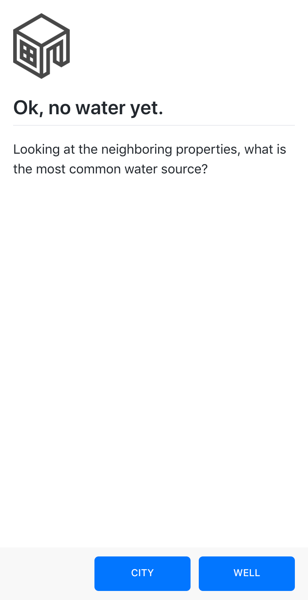

# Build Path

Create complex mobile walkthroughs tutorials with branching logic using markdown files in the `steps` directory and the `path.yml` config file.



### Get Started

Clone or fork this repo

```sh
yarn
now dev
```

Push to Github to deploy.

[Prose](https://prose.io) used as the CMS.

### Todo

- Gracefully handle more than three action buttons
- Save user position using localstorage
