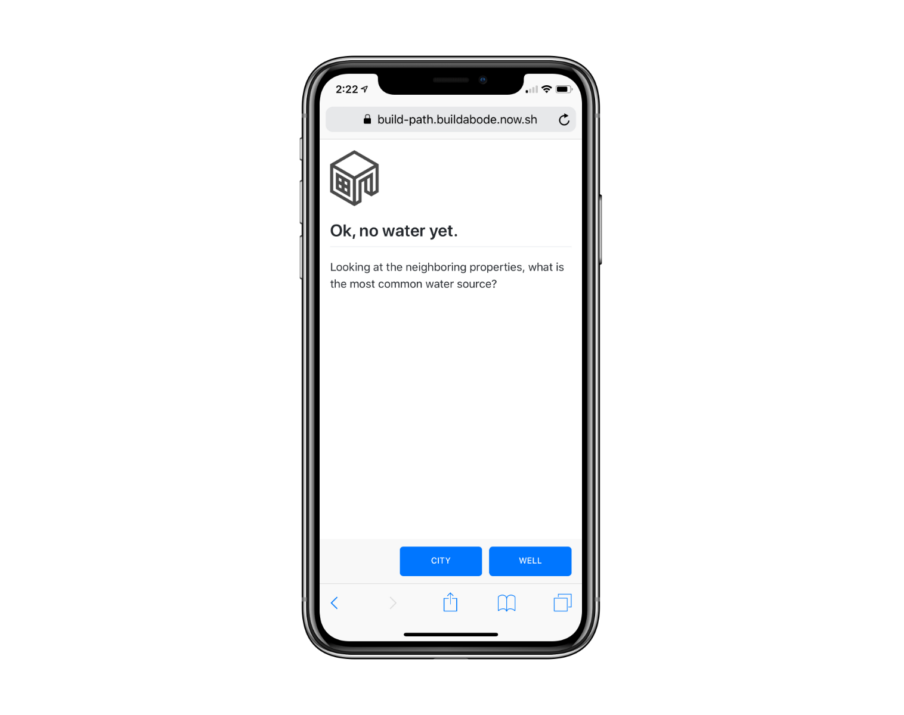

# Build Path

Create mobile walkthrough tutorials with branching logic using markdown files and a single config file.

Each step's content uses a markdown file in the `steps` directory. Steps are assigned actions which connect to other steps in `path.yml`.



### Get Started

Clone or fork this repo

```sh
yarn
now dev
```

Push to Github to deploy.

[Prose](https://prose.io) used as the CMS.

### Todo

- Gracefully handle more than three action buttons
- Save user position using localstorage
